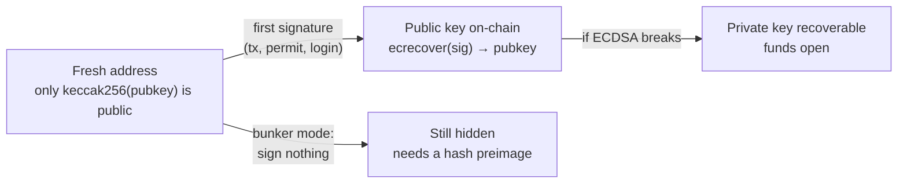
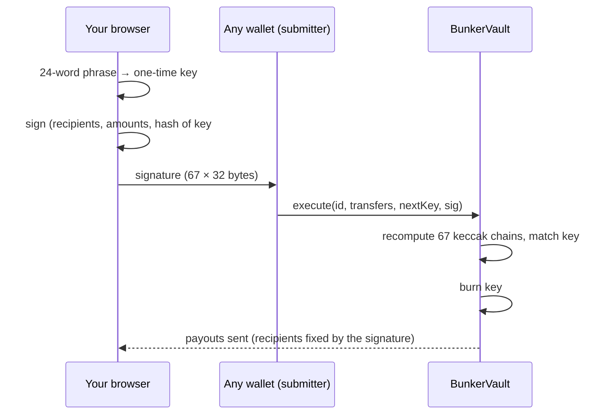
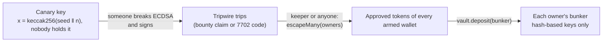

<p align="center">
  
</p>

<p align="center">
  <a href="https://etherscan.io/address/0xBDC4cE7c4718d20498e7D549751FF336690eb6D7#code"></a>
  <a href="https://sourcify.dev/#/lookup/0xBDC4cE7c4718d20498e7D549751FF336690eb6D7"></a>
  <a href="https://bunkereth.xyz"></a>
  <a href="https://x.com/BunkerCoinEth"></a>
  
  <a href="LICENSE"></a>
</p>

<p align="center">
  <b>Your public key is already out. Hide it behind a hash.</b><br />
  Scan exposed keys · sweep to a fresh address · hold funds where no ECDSA key can move them.
</p>

<p align="center">
  <a href="https://bunkereth.xyz"><b>Website</b></a> ·
  <a href="https://bunkereth.xyz/#docs"><b>Docs</b></a> ·
  <a href="https://bunkereth.xyz/#vault"><b>Vault</b></a> ·
  <a href="https://bunkereth.xyz/#tripwire"><b>Tripwire</b></a> ·
  <a href="https://x.com/BunkerCoinEth"><b>X</b></a> ·
  <a href="https://etherscan.io/token/0xBDC4cE7c4718d20498e7D549751FF336690eb6D7"><b>$BUNKER</b></a>
</p>

---

## Why

On 7 October 2026 Justin Drake [asked holders](https://x.com/drakefjustin/status/2107837081313505768) to calmly move funds
to addresses that have never signed, because a break of ECDSA may come sooner than expected. An address is only a hash of
its public key until it signs something; after that, the key is on-chain for good. Today 17 of the 20 largest plain-key ETH
holders have already published theirs ([live board](https://bunkereth.xyz/#board)).

BUNKER is the toolkit for bunker mode:

| | |
|---|---|
| **Scan** | which of your addresses already revealed their public key: 7 EVM chains, Bitcoin, Solana |
| **Move** | sweep a wallet into a fresh address that has never signed, chain by chain, in one confirmation where the wallet supports batching |
| **Vault** | hold ETH and tokens behind Winternitz one-time signatures over keccak256. No ECDSA key can move them, and every key is burned after one use |
| **Tripwire** | a public bounty for breaking ECDSA, wired to an escape hatch: the moment the canary key signs, every armed wallet's tokens move into its bunker |

## How a key gets exposed



## How a vault withdrawal works



The submitter only pays gas: it can not change recipients or amounts, and a front-runner can only submit the same signed
message. The signature scheme is the same family the [lean Ethereum roadmap](https://x.com/VitalikButerin/status/2108034068684435804)
uses for its post-quantum signatures (WOTS).

## Tripwire



- **Canary.** An Ethereum address whose secp256k1 public key is derived from a hash: x = keccak256("BUNKER/TRIPWIRE/CANARY/v1" ‖ uint256 counter)
  for the first counter on the curve, with the even y. The constructor computes it on-chain, so anyone can check nobody chose it.
  Canary: `0x2C25B452eD75ff1e606A3Af0ac463aE03901D351`.
- **Bounty.** ETH in the contract. `claim(to, v, r, s)` pays all of it against a canary signature of a digest the contract computes itself
  (with a freely chosen hash, a "signature" for any public key can be built without its key; the e2e test shows it passing raw `ecrecover`
  and failing `claim`). The digest names `to`, so a copied signature pays nobody else.
- **Trip.** Once and forever, on a valid claim or code at the canary address (an EIP-7702 delegation also needs its signature).
- **Escape.** Wallets `register(bunker, tokens)` and approve their tokens. Before the trip nothing can move. After it, anyone may call
  `escape` / `escapeMany`; each approved balance goes into the owner's registered bunker and nowhere else. A failing token is skipped,
  never blocks the rest.
- **Keeper.** `launch/tripwire.mjs keeper` watches the canary, trips the wire and sweeps every armed wallet in batches.
- **Limits.** ETH itself can not be pulled by approval (wrap to WETH). An attacker can skip the canary and go for big wallets first: this
  is an alarm and a bounty, not a guarantee. No owner, no admin, no upgrade, no fee.

## Contracts

Ethereum mainnet, verified on Etherscan and Sourcify.

| | address |
|---|---|
| $BUNKER | [`0xBDC4cE7c4718d20498e7D549751FF336690eb6D7`](https://etherscan.io/address/0xBDC4cE7c4718d20498e7D549751FF336690eb6D7#code) |
| BunkerVault | [`0x39C71b635409b1f98dc632e08d3B29515ddb2727`](https://etherscan.io/address/0x39C71b635409b1f98dc632e08d3B29515ddb2727#code) |
| BunkerTripwire | [`0x20085f519465288A5f4ed8917EB6e73429B2EE39`](https://etherscan.io/address/0x20085f519465288A5f4ed8917EB6e73429B2EE39#code) |
| Uniswap v4 pool id | `0x04d2cd739c30250554ceb5dad968b34e98e5932d3463e87f934c4d3a9484312b` |
| LP position | [#444506](https://etherscan.io/nft/0xbd216513d74c8cf14cf4747e6aaa6420ff64ee9e/444506), owned by the token contract |

`0x25B79CFdEF953D0a9Ee746b79B9f2A2F0bf18382` is an identical vault deployed by accident during launch; it is not used.

### $BUNKER

- **1,000,000,000** fixed supply, no mint, **no transfer tax**
- **LP locked inside the token**: the token minted its supply to itself and `launch()` created the Uniswap v4 ETH pool (1% tier)
  with the whole supply as one single-sided position owned by the token contract. No function removes liquidity or moves the
  position; `collectFees()` only claims trading fees
- 2% max wallet at launch, switched off for good with `removeLimits()` (block 26,144,084)
- No `permit()`: an off-chain signature would reveal the signer's public key

### BunkerVault

| | |
|---|---|
| Scheme | Winternitz one-time signatures, w = 16, 64 message + 3 checksum digits = 67 keccak256 chains |
| Chain step | `keccak256(x ‖ uint8(chain) ‖ uint8(step))`, public end at step 15 |
| Signed message | `keccak256(abi.encode(TAG, chainid, vault, id, nonce, relayer, fee, nextKey, keccak256(abi.encode(transfers))))` |
| Rotation | every `execute` burns the current key forever and switches to the signed `nextKey` |
| Payouts | fixed gas budget per payout; a low-gas front-run reverts instead of starving a payout; refused payouts become claimable by anyone for the recipient |
| Admin | none. No owner, no upgrade, no fee |
| Gas | about 200k–280k per withdrawal |

Full specification and usage: [bunkereth.xyz/#docs](https://bunkereth.xyz/#docs).

## Repository

```
contracts/   Foundry: BunkerToken.sol, BunkerVault.sol, BunkerTripwire.sol and their tests
site/        Vite + React + viem front end (scan, move, vault, docs)
             site/src/lib/wots.js is the browser signer used by the vault page
launch/      bunker-launch.mjs (deploy / launch / collect / status), tripwire.mjs (deploy / fund / status / keeper)
             and end-to-end tests
```

### Tests

```sh
npm install && (cd site && npm install)
cd contracts && forge install foundry-rs/forge-std --no-git && forge test     # vault + tripwire unit and fuzz tests
forge test --match-contract BunkerTokenFork --fork-url <mainnet rpc>         # launch, LP lock, max wallet on real Uniswap v4
cd .. && node launch/test/wots-e2e.mjs                                       # browser signer vs the contract
node launch/test/tripwire-e2e.mjs                                            # tripwire on a mainnet fork: real vault, real tokens, 7702, keeper
node launch/test/site-e2e.mjs                                                # whole site in headless Chromium on a mainnet fork
```

Needs [Foundry](https://getfoundry.sh) and, for the browser test, `npx playwright install chromium`.

## Security

The contracts have **not** had an external audit. They are covered by unit and fuzz tests and full mainnet-fork rehearsals.
Use the vault with amounts you can afford to lose; losing a bunker phrase loses the funds behind it. See [SECURITY.md](SECURITY.md).

Not financial advice.

## License

[MIT](LICENSE)
